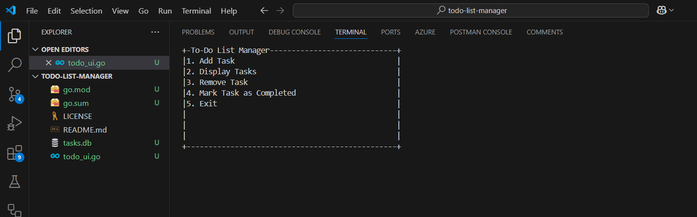

# To-Do List Manager

An interactive command-line To-Do List Manager built with Golang and SQLite, featuring an enhanced terminal UI using the `termui` library. This application helps users manage tasks effectively, ensuring better organization and productivity.

---

## **Features**

- **Task Management**: Add, view, remove, and mark tasks as completed.
- **Enhanced Terminal UI**: Navigate menus and tasks interactively with `termui`.
- **Persistence**: Tasks are saved in an SQLite database for reuse across sessions.
- **Detailed Task Attributes**:
  - **Deadline**: Set deadlines for tasks.
  - **Priority**: Assign priorities (Low, Medium, High).
  - **Category**: Categorize tasks for better organization.

---

## **Tech Stack**

 

    
    
    
   
 

---

## **Installation**

1. Clone the repository:
   ```bash
   git clone https://github.com/<your-username>/todo-list-manager.git
   cd todo-list-manager
   
2. Install required dependencies:
```bash
   go get github.com/mattn/go-sqlite3
   go get github.com/gizak/termui/v3
```

3. Run the application:
```bash
   go run todo_ui.go
```

## Usage
Navigate the menu using Up and Down arrow keys.   
Press Enter to select an option:   
Add a new task with details like description, deadline, priority, and category.   
View the list of all tasks (completed and pending).   
Remove a task by entering its ID.   
Mark a task as completed.   
Exit the application with q or ctrl + C.   

## Screenshots


## Contributing
Contributions are welcome! If you have ideas for new features or improvements, feel free to submit a pull request.

## License
This project is licensed under the MIT License. See the `LICENSE` file for details.

## Contact
For issues or suggestions, feel free to reach out:
Author: Sk Md Rizwan
Email: skmdrizwan2003@gmail.com
